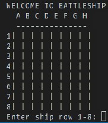
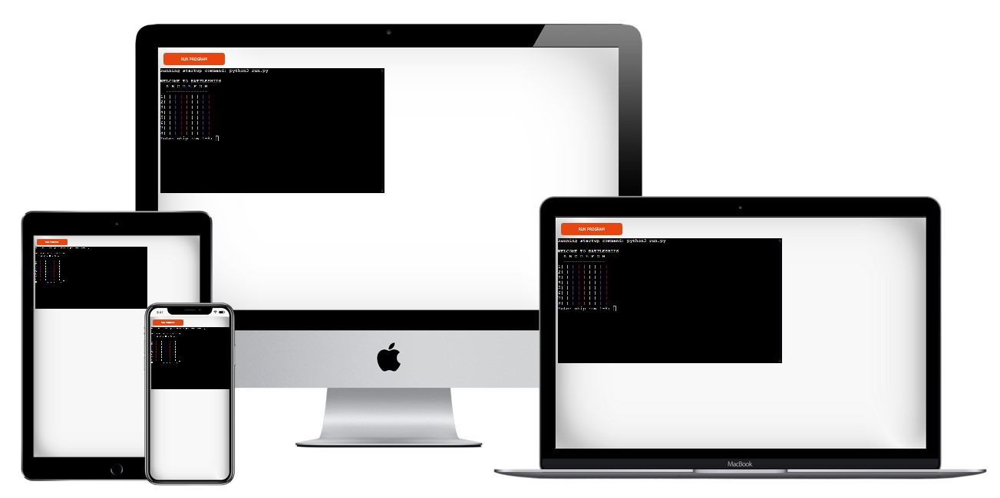
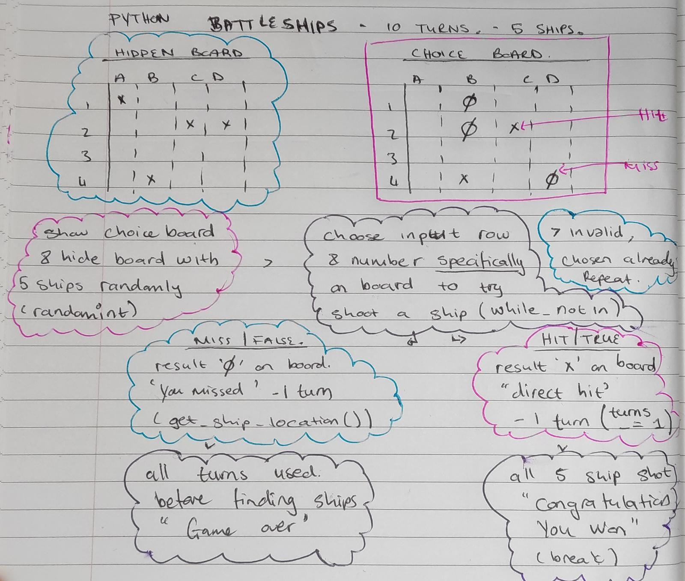
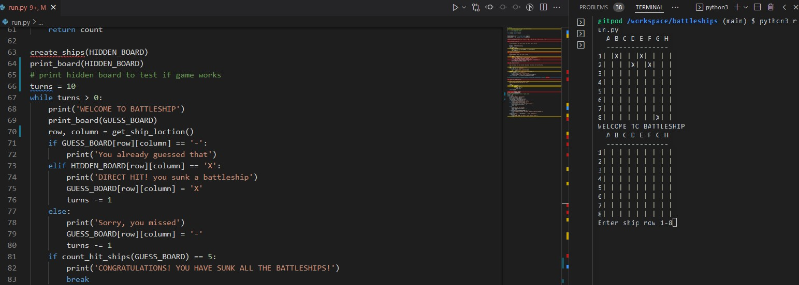
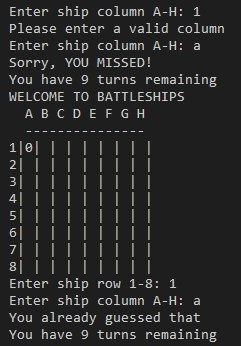
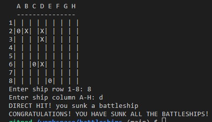
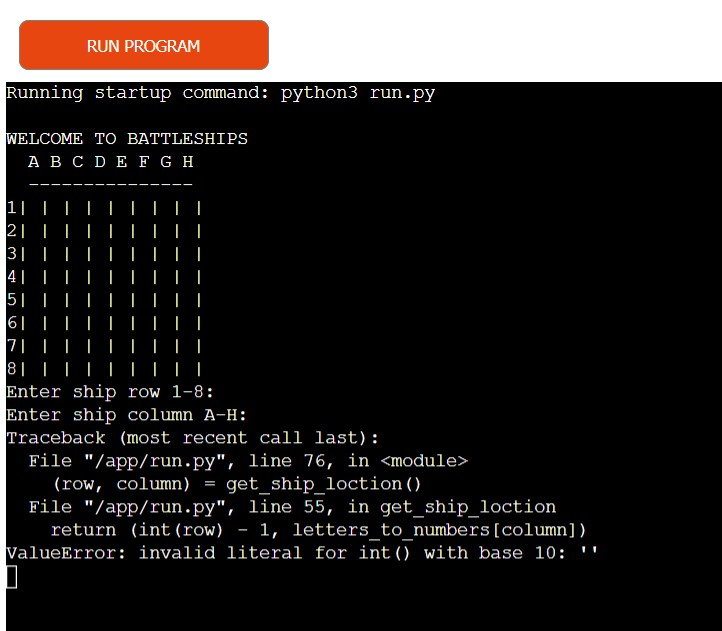
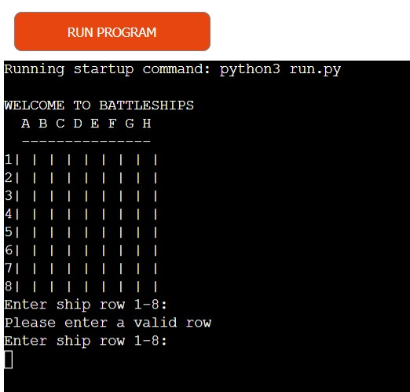
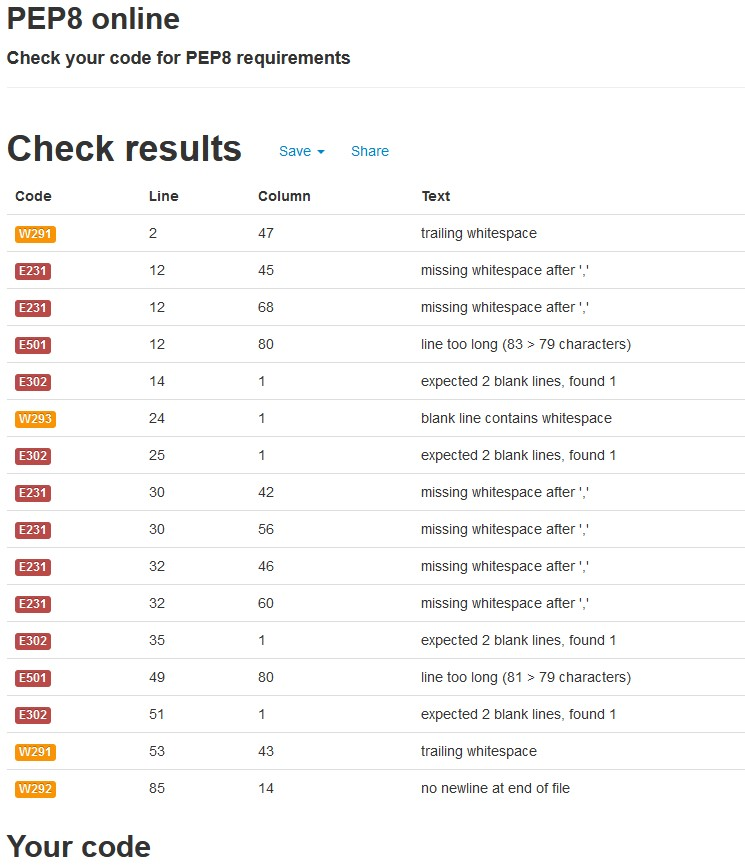
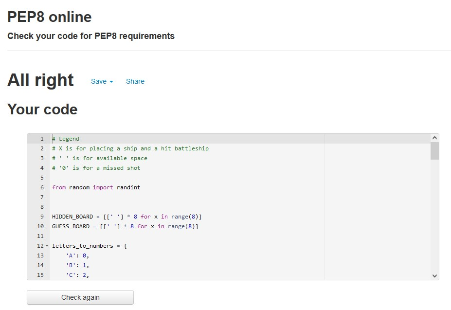

# BATTLESHIPS

This Battleship game is a Python terminal Game, which runs in the Code Institutemock terminal on Heroku.

Users can try and beat the computer by finding the computer's hidden battleship before their shot(turns) has run out.
Each battleship occupies one(-) on the board. The user selects a row number and column letter to target their shot.
A direct hit destroys 1 of 5 Battleships and a turn is taken. If they miss they still lose a turn and a chance to win the game.
when all 5 ships have sunk the user will win the game.

Here is a live version of the Python terminal game Battleship: 

**Here is a live REVISED version of my project**

- https://battleships-chloe-js.herokuapp.com/

## How to Play
Based on the classic Battleship board game.
The user is prompted with a choice of row and number to select coordinates to attack the battleground.
They cannot see where the ships are located on the hidden board but they make a choice on where to attack.
If they miss the battleship board, it will mark a '0' on the user board.
If they hit the target the board will mark an 'X' on the user board.
The user is only allocated a limited amount of turns to make their choices to make it harder to find all the ships.
Every choice they make the user has deducted a turn.
If their turns run out before they find all the ships, they lose and the game will restart.
If they find all 5 before their turns run out, they will then win the game.
## User Story

We want to create an interactive guessing game written in Python where the user can choose where a battleship may be hidden and attack it.
The challenge is that they only have a limited amount of turns in order to find all the hidden battleships
* First we would need to create two boards.
  * One would be hidden with the randomly selected 5 ships marked on the board.
  * The second would be visible and blank for the user to show where he has previously attached and where they have sunk battleships.

* The user would then be prompted to input a row and a number for the co-ordinates of where they would like to strike

* If it is a 'Direct Hit' where the user has selected the exact location of the randomly generated location
  * 'X' will be marked on the visible board
  * -1 turn will be taken away from their total turns

* If the user has 'Missed' their target
  * a '0' will be marked on the visible board
  * -1 turn will be taken away from their total turns

* If the incorrect data is input outside the scope of the board, an error will be displayed and the user will select a new location.

* If all 10 of the turns have been used up without finding all of the battleships
  * The computer wins and the user loses

* When all 5 hidden ships have been hit
  * The User wins the game

## User Story Testing
* While testing if the game works, I chose to print() the hidden board so that I could see exactly where the computer had randomly selected to put the battleships.

* When selecting the row and number for the co-ordinate of the attack we need to create a while, not in a statement to specify that only the numbers and letters in this range can be chosen otherwise the code cannot run because the location would not exist.
* We also need to ensure that if the same location is input that it does not deduct a turn twice and the user is prompted to choose a different location.
* We need to create a limit on how many times the user can guess on the hidden board by giving the user only 10 turns to guess the location.
* The game will end when all 5 ships have been found or all 10 turns have been used.
## Features
### Existing Features
* Board Generation
  * 5 random computer selected ship locations are marked on a hidden board
  * The user will use one turn to guess where they are by selecting a number and letter
  * Each guesses they make deducts a turn from their total amount of turns, 10

* GAme asks for user input of a row, number, and a column, letter for the coordinates of the attack
  * KeyError is prompted if the incorrect number or letter range is given and asks for correct input

  * If the user has already hit in the same location the computer will prompt a second selection because they hit in the same place, without them losing a turn

* The inputs are then marked on the board with an 'X' and missed hits are marked with a '0'
* If all 5 ships are found before the user 10 turns have been used, the user is the winner

### Added Validtation for no input, REVISED

* An error occurred after submission where if no input was selected the program ran until both the row and column were invalid inputs. This caused the program to crash.
* I then added further validation of .strip() to my get_ship_loction function to ensure that if nothing is input then an error occurs and a request to input a valid row or number is prompted.

* I also imported the 'random' library to input the randint range of numbers for 'my create_ships(board)' function in order for there to be randomly selected ships hidden for each new game started.

### Further Features
* Chose how many turns were available
* Chose how many ships are hidden
* Have ships larger than 1 block

# Testing
I have manually tested this project by doing the following:
* Passing the run.py file through a PEP8 linter and confirmed there are now no problems.
* Given invalid inputs: strings instead of integers, multiple inputs instead of single, out of bound inputs, and the same input twice.
* Tested in my local terminal and the Code Institute Heroku terminal
* Revised, I have also done peer testing with friends to see if there are any further errors.
## Validator Testing
* PEP8 online

* When inserting my python code into the PEP8 validator, there were several issues to deal with.
  * Trailing white space
  * Line too long
  * Insert 2 blank lines before the def

* After editing the errors in the validator
  * No errors were returned from PEP8online.com
## Bugs
* When I wrote the code, I had a lot of errors with white space because I could not see it when looking through my code, but when I put it through the PEP8 validator I was able to find them
* If a user inputs nothing (empty string) and enters an empty row and column. no input errors but after both blank inputs, the input returns an error is displayed in the terminal. after the program has crashed. 
* REVISED, this error of a blank input being entered has now been corrected with adding the.STRIP() function.
This now does not allow any black input and the while loops of numbers 1-8 and letters of A-H, force the user to input only the options given in the battlefield. 

## Constraints

The deployment terminal is set to 80 columns by 24 rows. That means that each line of text needs to be 80 characters or less otherwise it will be wrapped onto a second line.

## Deployment
This project was deployed using Code Institue's mock terminal for Heroku.

* Steps for deployment:

  * Clone the repository
  * Create a new Heroku app
When you create the app, you will need to add two build packs from the _Settings_ tab. The ordering is as follows:

1. `heroku/python`
2. `heroku/nodejs`

You must then create a _Config Var_ called `PORT`. Set this to `8000`
  * Set the build back to Python and NodeJS in that order
  * Link the Heroku app to the repository
  * Click on Deploy

## Credits
* Code Institue for the deployment terminal
* Code Institue 'Sample README.md file'
- (https://learn.codeinstitute.net/courses/course-v1:CodeInstitute+PE_PAGPPF+2021_Q2/courseware/b3378fc1159e43e3b70916fdefdfae51/605f34e006594dc4ae19f5e60ec75e2e/)

* Wikipedia for details of the Battleship game
- (https://en.wikipedia.org/wiki/Battleship)
* 'guachilimbo' an example of Python code of Battleship played in the terminal
- (https://github.com/guachilimbo/battleship/blob/main/Battleship.py/)

* Making a Python Battleship Game With Source Code
- (https://pythondex.com/python-battleship-game)
